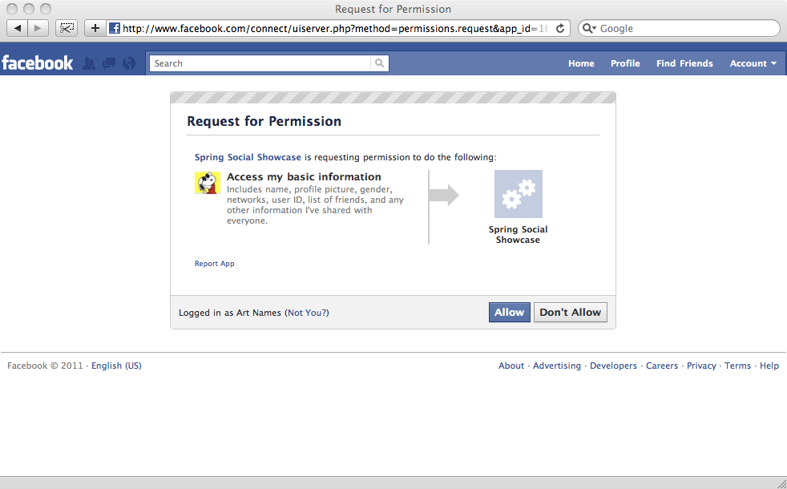

= Spring Social Reference
Craig Walls; Keith Donald; Roy Clarkson; Greg Turnquist

The Spring Social project enables your applications to establish
Connections with Software-as-a-Service (SaaS) Providers such as Facebook
and Twitter to invoke APIs on behalf of Users.

== Introduction

[[section_preface]]
=== Socializing applications
The phrase "social networking" often refers to efforts aimed at bringing
people together. In the software world, those efforts take the form of
online social networks such as Facebook, Twitter, and LinkedIn. Over a 
billion of this world's internet users have flocked to these
services to keep frequent contact with family, friends, and colleagues.

Under the surface, however, these services are just software
applications that gather, store, and process information. Just like so
many applications written before, these social networks have users who
sign in and perform some activity offered by the service.

What makes these applications a little different than traditional
applications is that the data that they collect represent some facet of
their users' lives. What's more, these applications are more than
willing to share that data with other applications, as long as the user
gives permission to do so. This means that although these social
networks are great at bringing people together, as software services
they also excel at bringing applications together.

To illustrate, imagine that Paul is a member of an online movie club. A
function of the movie club application is to recommend movies for its
members to watch and to let its members maintain a list of movies that
they have seen and those that they plan to see. When Paul sees a movie,
he signs into the movie club site, checks the movie off of his viewing
list, and indicates if he liked the movie or not. Based on his
responses, the movie club application can tailor future recommendations
for Paul to see.

On its own, the movie club provides great value to Paul, as it helps him
choose movies to watch. But Paul is also a Facebook user. And many of
Paul's Facebook friends also enjoy a good movie now and then. If Paul
were able to connect his movie club account with his Facebook profile,
the movie club application could offer him a richer experience. Perhaps
when he sees a movie, the application could post a message on his
Facebook wall indicating so. Or when offering suggestions, the movie
club could factor in the movies that his Facebook friends liked.

Social integration is a three-way conversation between a service
provider, a service consumer, and a user who holds an account on both
the provider and consumer. All interactions between the consumer and the
service provider are scoped to the context of the user's profile on the
service provider.

In the narrative above, Facebook is the service provider, the movie club
application is the service consumer, and Paul is the user of both. The
movie club application may interact with Facebook on behalf of Paul,
accessing whatever Facebook data and functionality that Paul permits,
including retrieving Paul's friends and posting messages to his wall.

From the user's perspective, both applications provide some valuable
functionality. But by connecting the user's account on the consumer
application with his account on the provider application, the user
brings together two applications that can now offer the user more value
than they could individually.

With Spring Social, your application can play the part of the service
consumer, interacting with a service provider on behalf of its users.
The key features of Spring Social are:

* A "Connect Framework" that handles the core authorization and
connection flow with service providers.
* A "Connect Controller" that handles the OAuth exchange between a
service provider, consumer, and user in a web application environment.
* A "Signin Controller" that allows users to authenticate with your
application by signing in with their Provider accounts, such as their
Twitter or Facebook accounts.

In addition, there are a handful of provider-specific modules that
extend Spring Social to enable integration with popular SaaS providers,
including Facebook and Twitter.

[[section_how-to-get]]
=== Getting Spring Social
The core Spring Social project consists of the modules described in <<table_modules>>.

[[table_modules]]
.Spring Social Modules
[options="header"]
|=======================================================================
|Name |Description
|spring-social-core |Spring Social's Connect Framework and OAuth client support.
|spring-social-config |Java and XML configuration support for Spring Social.
|spring-social-security |Spring Security integration support.
|spring-social-web |Spring Social's ConnectController which uses the Connect Framework to manage connections in a web application environment.
|=======================================================================

Which of these modules your application needs will largely depend on
what facets of Spring Social you intend to use. 

==== Gradle

At very minimum, you'll need the core module in your application's classpath:

.build.gradle
[source,groovy,subs="attributes,verbatim"]
----
compile "org.springframework.social:spring-social-core:{spring-social-version}"
----

To let Spring Social handle the back-and-forth authorization handshake
between your web application and a service provider, you'll need the web
module:

.build.gradle
[source,groovy,subs="attributes,verbatim"]
----
compile "org.springframework.social:spring-social-web:{spring-social-version}"
----

You'll probably want to take advantage of Spring Social's simplified configuration
support for XML and/or Java configuration. If so, you'll need the config module:

.build.gradle
[source,groovy,subs="attributes,verbatim"]
----
compile "org.springframework.social:spring-social-config:{spring-social-version}"
----

If you want to integrate Spring Social with Spring Security to enable users to sign
into your application via Facebook, Twitter, or another provider, you'll need the
security module:

.build.gradle
[source,groovy,subs="attributes,verbatim"]
----
compile "org.springframework.social:spring-social-security:{spring-social-version}"
----

Final GA releases of Spring Social will be available in the Maven Central repository.
But if you are developing against a milestone or release candidate version,
such as 1.1.0.M1 or 1.1.0.RC1, then you will need to add Spring's milestone
repository to your build in order to resolve the artifacts:

.build.gradle
[source,groovy,subs="attributes,verbatim"]
----
repositories {
  mavenLocal()
  maven { url 'http://maven.springframework.org/milestone' }
  mavenCentral()
}
----

Similarly, if you are trying out the latest nightly build version (e.g.
1.1.0.BUILD-SNAPSHOT), you will need to add Spring's snapshot repository:

.build.gradle
[source,groovy,subs="attributes,verbatim"]
----
repositories {
  mavenLocal()
  maven { url 'http://maven.springframework.org/snapshot' }
  mavenCentral()
}
----

==== Maven

At very minimum, you'll
need the core module in your application's classpath (as a Maven `<dependency>`):

.pom.xml
[source,xml,subs="attributes,verbatim"]
----
<dependency>
    <groupId>org.springframework.social</groupId>
    <artifactId>spring-social-core</artifactId>
    <version>{spring-social-version}</version>
</dependency>
----

Or, if you're using Gradle to build your project:

.build.gradle
[source,groovy,subs="attributes,verbatim"]
----
compile "org.springframework.social:spring-social-core:{spring-social-version}"
----

To let Spring Social handle the back-and-forth authorization handshake
between your web application and a service provider, you'll need the web
module:

.pom.xml
[source,xml,subs="attributes,verbatim"]
----
<dependency>
    <groupId>org.springframework.social</groupId>
    <artifactId>spring-social-web</artifactId>
    <version>{spring-social-version}</version>
</dependency>
----

You'll probably want to take advantage of Spring Social's simplified configuration
support for XML and/or Java configuration. If so, you'll need the config module:

.pom.xml
[source,xml,subs="attributes,verbatim"]
----
<dependency>
    <groupId>org.springframework.social</groupId>
    <artifactId>spring-social-config</artifactId>
    <version>{spring-social-version}</version>
</dependency>
----

If you want to integrate Spring Social with Spring Security to enable users to sign
into your application via Facebook, Twitter, or another provider, you'll need the
security module:

.pom.xml
[source,xml,subs="attributes,verbatim"]
----
<dependency>
    <groupId>org.springframework.social</groupId>
    <artifactId>spring-social-security</artifactId>
    <version>{spring-social-version}</version>
</dependency>
----

Final GA releases of Spring Social will be available in the Maven Central repository.
But if you are developing against a milestone or release candidate version,
such as 1.1.0.M1 or 1.1.0.RC1, then you will need to add the following
repository to your build in order to resolve the artifacts:

.pom.xml
[source,xml,subs="attributes,verbatim"]
----
<repository>
    <id>org.springframework.maven.milestone</id>
    <name>Spring Maven Milestone Repository</name>
        <url>http://repo.spring.io/milestone</url>
</repository>
----

Similarly, if you are trying out the latest nightly build version (e.g.
1.1.0.BUILD-SNAPSHOT), you will need to add the following repository:

.pom.xml
[source,xml,subs="attributes,verbatim"]
----
<repository>
    <id>org.springframework.maven.snapshot</id>
    <name>Spring Maven Snapshot Repository</name>
        <url>http://repo.spring.io/snapshot</url>
</repository>
----

[[section_client-modules]]
==== Client modules
In addition to modules that make up the core Spring Social project,
there are a number of provider-specific client modules that are released
separately that provide connectivity and API bindings to popular SaaS
providers. These client modules are listed in <<table_clientModules>>.

[[table_clientModules]]
.Spring Social Client Modules
[options="header"]
|=======================================================================
|Name |Maven group ID |Maven artifact ID
|http://docs.spring.io/spring-social-facebook/site/docs/1.1.0.RC1/reference/htmlsingle/[Spring Social Facebook] |org.springframework.social |spring-social-facebook
|http://docs.spring.io/spring-social-twitter/site/docs/1.1.0.RC1/reference/htmlsingle/[Spring Social Twitter] |org.springframework.social |spring-social-twitter
|http://docs.spring.io/spring-social-linkedin/site/docs/1.1.0.RC1/reference/htmlsingle/[Spring Social LinkedIn] |org.springframework.social |spring-social-linkedin
|Spring Social GitHub |org.springframework.social |spring-social-github
|Spring Social TripIt |org.springframework.social |spring-social-tripit
|=======================================================================

All of these modules are optional, depending on the connectivity needs
of your application. For instance, if your application will connect with
Facebook, you'll want to add the Facebook module to your project.
In Gradle:

.build.gradle
[source,groovy,subs="attributes,verbatim"]
----
compile "org.springframework.social:spring-social-facebook:{spring-social-version}"
----

Or in Maven:

.pom.xml
[source,xml,subs="attributes,verbatim"]
----
<dependency>
    <groupId>org.springframework.social</groupId>
    <artifactId>spring-social-facebook</artifactId>
    <version>{spring-social-version}</version>
</dependency>
----

Note that each of the client modules will progress and release on a
different schedule than Spring Social. Consequently, the version numbers
for any given client module may not align with Spring Social or any
other client module.

Refer to each client module's reference documentation for details on
connectivity and the API binding.

[[section_dependencies]]
==== Dependencies
Spring Social depends on a few things to run. Most dependencies are
optional and an effort has been made to keep the required dependencies
to a minimum. The project dependencies are described in this section.

===== Java
Spring Social requires Java 1.6 or greater.

===== Java Servlet API
The Spring Social web support requires Java Servlet 2.5 or greater
(Tomcat 6+). We recommend, however, that you use Java Servlet 3.0 or greater.

===== Spring Framework
Spring Social depends on `RestTemplate` provided by the core
http://www.springsource.org/documentation[Spring Framework] in the
spring-web module. It requires Spring Framework version 3.1 or above, although
Spring Framework 4.0 is recommended.

===== Spring Security Crypto
If you're not already using Spring Security to secure your application,
you'll need to add the standalone crypto module. This is required for
OAuth1 request signing and encrypting credentials when persisting
connection data. If you're already using Spring Security, there is
nothing for you to do because the crypto library comes included.

.pom.xml
[source,xml,subs="attributes,verbatim"]
----
<dependency>
    <groupId>org.springframework.security</groupId>
    <artifactId>spring-security-crypto</artifactId>
    <version>{spring-security-version}</version>
</dependency>
----

===== Apache HttpComponents
Spring Social has an optional dependency on
http://hc.apache.org/httpcomponents-client-ga[Apache HttpComponents]. If
the HttpComponents HttpClient library is present, it will use it as the
HTTP client (which is generally recommended). Otherwise, it will fall
back on standard J2SE facilities.

.pom.xml
[source,xml,subs="attributes,verbatim"]
----
<dependency>
    <groupId>org.apache.httpcomponents</groupId>
    <artifactId>httpclient</artifactId>
    <version>{httpComponentsVersion}</version>
</dependency>
----

Even thought HttpComponents is an optional dependency, we strongly recommend it over the fallback option.

===== Jackson JSON Processor
Spring Social's provider API bindings rely on the
http://jackson.codehaus.org/[Jackson JSON Processor] to map JSON
responses to Java objects. Each binding, such as Facebook or Twitter,
transitively depends on Jackson {jacksonVersion}, so there's nothing special to do
to add Jackson to your project's Maven or Gradle build.

==== Sample Code
We have created a few sample applications to illustrate the capabilities
of Spring Social. To obtain the
https://github.com/SpringSource/spring-social-samples code, use the
following git command:

```sh
$ git clone git://github.com/SpringSource/spring-social-samples.git
```

The Spring Social Samples project includes the following samples:

* spring-social-quickstart - Designed to get you up and running quickly.
* spring-social-showcase - Illustrates most of Spring Social's features.
* spring-social-showcase-sec - Illustrates most of Spring Social's features,
including Spring Security integration.
* spring-social-movies - Shows how to extend Spring Social to implement
a new `ServiceProvider` and API binding.
* spring-social-twitter4j - Shows how to extend Spring Social and re-use
an existing API binding.
* spring-social-popup - Shows how to use Spring Social to drive a
browser popup-based connection flow.
* spring-social-canvas - Demonstrates how to use Spring Social within a
Facebook Canvas application.

[[connectFramework]]
== Service Provider 'Connect' Framework
The `spring-social-core` module includes a _Service Provider Connect Framework_ 
for managing connections to Software-as-a-Service (SaaS)
providers such as Facebook and Twitter. This framework allows your
application to establish connections between local user accounts and
accounts those users have with external service providers. Once a
connection is established, it can be be used to obtain a strongly-typed
Java binding to the ServiceProvider's API, giving your application the
ability to invoke the API on behalf of a user.

To illustrate, consider Facebook as an example ServiceProvider. Suppose
your application, AcmeApp, allows users to share content with their
Facebook friends. To support this, a connection needs to be established
between a user's AcmeApp account and her Facebook account. Once
established, a Facebook instance can be obtained and used to post
content to the user's wall. Spring Social's 'Connect' framework provides
a clean API for managing service provider connections such as this.

[[section_coreApi]]
=== Core API
The `Connection<A>` interface models a connection to an external service
provider such as Facebook:

```java
public interface Connection<A> extends Serializable {
    
    ConnectionKey getKey();
    
    String getDisplayName();

    String getProfileUrl();

    String getImageUrl();

    void sync();

    boolean test();

    boolean hasExpired();

    void refresh();

    UserProfile fetchUserProfile();

    void updateStatus(String message);

    A getApi();

    ConnectionData createData();

}
```

Each `Connection` is uniquely identified by a composite key consisting of
a `providerId` (e.g. 'facebook') and connected `providerUserId` (e.g.
'738140579', for Craig Walls' Facebook ID). This key tells you what
provider user the connection is connected to.

A `Connection` has a number of meta-properties that can be used to render
it on a screen, including a `displayName`, `profileUrl`, and `imageUrl`. As an
example, the following HTML template snippet could be used to generate a
link to the connected user's profile on the provider's site:

```xml
 <a href="${connection.profileUrl}">${connection.displayName}</a>            
```

The value of these properties may depend on the state of the provider
user's profile. In this case, `sync()` can be called to synchronize these
values if the user's profile is updated.

A `Connection` can be tested to determine if its authorization credentials
are valid. If invalid, the connection may have expired or been revoked
by the provider. If the connection has expired, a connection may be
refreshed to renew its authorization credentials.

A `Connection` provides several operations that allow the client
application to invoke the `ServiceProvider`'s API in a uniform way. This
includes the ability to fetch a model of the user's profile and update
the user's status in the provider's system.

A `Connection`'s parameterized type `<A>` represents the Java binding to the
`ServiceProvider`'s native API. An instance of this API binding can be
obtained by calling `getApi()`. As an example, a Facebook connection
instance would be parameterized as `Connection<Facebook>`. `getApi()`
would return a `Facebook` instance that provides a Java binding to
Facebook's graph API for a specific Facebook user.

Finally, the internal state of a connection can be captured for transfer
between layers of your application by calling `createData()`. This could
be used to persist the connection in a database, or serialize it over
the network.

To put this model into action, suppose we have a reference to a
`Connection<Twitter>` instance. Suppose the connected user is the Twitter
user with screen name 'jbauer'.

1.  `Connection#getKey()` would return ('twitter', '14710604') where
'14710604' is @jbauer's Twitter-assigned user id that never changes.
2.  `Connection#getDisplayName()` would return '@jbauer'.
3.  `Connection#getProfileUrl()` would return
'http://twitter.com/jbauer'.
4.  `Connection#getImageUrl()` would return
'http://a0.twimg.com/profile_images/105951287/IMG_5863_2_normal.jpg'.
5.  `Connection#sync()` would synchronize the state of the connection with
@jbauer's profile.
6.  `Connection#test()` would return `true` indicating the authorization
credentials associated with the Twitter connection are valid. This
assumes Twitter has not revoked the AcmeApp client application, and
@jbauer has not reset his authorization credentials (Twitter
connections do not expire).
7.  `Connection#hasExpired()` would return `false`.
8.  `Connection#refresh()` would not do anything since connections to
Twitter do not expire.
9.  `Connection#fetchUserProfile()` would make a remote API call to
Twitter to get @jbauer's profile data and normalize it into a
`UserProfile` model.
10. `Connection#updateStatus(String)` would post a status update to
@jbauer's timeline.
11. `Connection#getApi()` would return a Twitter giving the client
application access to the full capabilities of Twitter's native API.
12. `Connection#createData()` would return `ConnectionData` that could be
serialized and used to restore the connection at a later time.

[[section_establishingConnections]]
=== Establishing connections
So far we have discussed how existing connections are modeled, but we
have not yet discussed how new connections are established. The manner
in which connections between local users and provider users are
established varies based on the authorization protocol used by the
`ServiceProvider`. Some service providers use OAuth, others use HTTP Basic
Auth, others may use something else. Spring Social currently provides
native support for OAuth-based service providers, including support for
OAuth 1 and OAuth 2. This covers the leading social networks, such as
Facebook and Twitter, all of which use OAuth to secure their APIs.
Support for other authorization protocols can be added by extending the
framework.

Each authorization protocol is treated as an implementation detail where
protocol-specifics are kept out of the core Connection API. A
`ConnectionFactory` abstraction encapsulates the construction of
connections that use a specific authorization protocol. In the following
sections, we will discuss the major `ConnectionFactory` classes provided
by the framework. Each section will also describe the protocol-specific
flow required to establish a new connection.

[[section_oauth2ServiceProviders]]
==== OAuth2 service providers
OAuth 2 is rapidly becoming a preferred authorization protocol, and is
used by major service providers such as Facebook, Github, Foursquare,
and Google. In Spring Social, an `OAuth2ConnectionFactory` is used to
establish connections with a OAuth2-based service provider:

```java
public class OAuth2ConnectionFactory<A> extends ConnectionFactory<A> {

    public OAuth2Operations getOAuthOperations();

    public Connection<A> createConnection(AccessGrant accessGrant);

    public Connection<A> createConnection(ConnectionData data);

    public void setScope(String scope);

    public String getScope();

    public String generateState();

    public boolean supportsStateParameter();

}
```

`getOAuthOperations()` returns an API to use to conduct the authorization
flow, or "OAuth Dance", with a service provider. The result of this flow
is an `AccessGrant` that can be used to establish a connection with a
local user account by calling `createConnection()`. The `OAuth2Operations`
interface is shown below:

```java
public interface OAuth2Operations {

    String buildAuthorizeUrl(OAuth2Parameters parameters);

    String buildAuthorizeUrl(GrantType grantType, OAuth2Parameters parameters);

    String buildAuthenticateUrl(OAuth2Parameters parameters);

    String buildAuthenticateUrl(GrantType grantType, OAuth2Parameters parameters);

    AccessGrant exchangeForAccess(String authorizationCode, String redirectUri, 
        MultiValueMap<String, String> additionalParameters);

    AccessGrant exchangeCredentialsForAccess(String username, String password, 
        MultiValueMap<String, String> additionalParameters);

    AccessGrant refreshAccess(String refreshToken,
        MultiValueMap<String, String> additionalParameters);

    AccessGrant authenticateClient();

    AccessGrant authenticateClient(String scope);

}
```

Callers are first expected to call `buildAuthorizeUrl(GrantType, OAuth2Parameters)` 
to construct the URL to redirect the user to for
connection authorization. Upon user authorization, the authorization code
returned by the provider should be exchanged for an `AccessGrant`. The
`AccessGrant` should then used to create a connection. This flow is
illustrated below:

image:resources/images/oauth2_flow.png[image]

As you can see, there is a back-and-forth conversation that takes place
between the application and the service provider to grant the
application access to the provider account. This exchange, commonly
known as the "OAuth Dance", follows these steps:

1.  The flow starts by the application redirecting the user to the
provider's authorization URL. Here the provider displays a web page
asking the user if he or she wishes to grant the application access to
read and update their data.
2.  The user agrees to grant the application access.
3.  The service provider redirects the user back to the application (via
the redirect URI), passing an authorization code as a parameter.
4.  The application exchanges the authorization code for an access
grant.
5.  The service provider issues the access grant to the application. The
grant includes an access token and a refresh token. One receipt of these
tokens, the "OAuth dance" is complete.
6.  The application uses the `AccessGrant` to establish a connection
between the local user account and the external provider account. With
the connection established, the application can now obtain a reference
to the Service API and invoke the provider on behalf of the user.

The example code below shows use of a `FacebookConnectionFactory` to
create a connection to Facebook using the OAuth2 server-side flow
illustrated above. Here, `FacebookConnectionFactory` is a subclass of
`OAuth2ConnectionFactory`:

```java
FacebookConnectionFactory connectionFactory = 
    new FacebookConnectionFactory("clientId", "clientSecret");
OAuth2Operations oauthOperations = connectionFactory.getOAuthOperations();
OAuth2Parameters params = new OAuth2Parameters();
params.setRedirectUri("https://my-callback-url");
String authorizeUrl = oauthOperations.buildAuthorizeUrl(params);
response.sendRedirect(authorizeUrl);

// upon receiving the callback from the provider:
AccessGrant accessGrant = oauthOperations.exchangeForAccess(authorizationCode, "https://my-callback-url", null);
Connection<Facebook> connection = connectionFactory.createConnection(accessGrant);
```

The following example illustrates the client-side "implicit"
authorization flow also supported by OAuth2. The difference between this
flow and the server-side "authorization code" flow above is the provider
callback directly contains the access grant (no additional exchange is
necessary). This flow is appropriate for clients incapable of keeping
the access grant credentials confidential, such as a mobile device or
JavaScript-based user agent.

```java
FacebookConnectionFactory connectionFactory = 
    new FacebookConnectionFactory("clientId", "clientSecret");
OAuth2Operations oauthOperations = connectionFactory.getOAuthOperations();
OAuth2Parameters params = new OAuth2Parameters();
params.setRedirectUri("https://my-callback-url");
String authorizeUrl = oauthOperations.buildAuthorizeUrl(GrantType.IMPLICIT_GRANT, params);
response.sendRedirect(authorizeUrl);

// upon receiving the callback from the provider:
AccessGrant accessGrant = new AccessGrant(accessToken);
Connection<Facebook> connection = connectionFactory.createConnection(accessGrant);
```

[[section_oauth1ServiceProviders]]
==== OAuth1 service providers

OAuth 1 is the previous version of the OAuth protocol. It is more
complex OAuth 2, and sufficiently different that it is supported
separately. Twitter, Linked In, and TripIt are some of the well-known
ServiceProviders that use OAuth 1. In Spring Social, the
`OAuth1ConnectionFactory` allows you to create connections to a
OAuth1-based Service Provider:

```java
public class OAuth1ConnectionFactory<A> extends ConnectionFactory<A> {

    public OAuth1Operations getOAuthOperations();

    public Connection<A> createConnection(OAuthToken accessToken);

    public Connection<A> createConnection(ConnectionData data);

}
```

Like a OAuth2-based provider, `getOAuthOperations()` returns an API to use
to conduct the authorization flow, or "OAuth Dance". The result of the
OAuth 1 flow is an `OAuthToken` that can be used to establish a connection
with a local user account by calling `createConnection()`. The
`OAuth1Operations` interface is shown below:

```java
public interface OAuth1Operations {

    OAuth1Version getVersion();

    OAuthToken fetchRequestToken(String callbackUrl, 
        MultiValueMap<String, String> additionalParameters);

    String buildAuthorizeUrl(String requestToken, OAuth1Parameters parameters);

    String buildAuthenticateUrl(String requestToken, OAuth1Parameters parameters);

    OAuthToken exchangeForAccessToken(AuthorizedRequestToken requestToken, 
        MultiValueMap<String, String> additionalParameters);

}
```

Callers are first expected to call `fetchNewRequestToken(String)` to
obtain a temporary token from the service provider to use during the
authorization session. Next, callers should call
`buildAuthorizeUrl(String, OAuth1Parameters)` to construct the URL to
redirect the user to for connection authorization. Upon user
authorization, the authorized request token returned by the provider
should be exchanged for an access token. The access token should then
used to create a connection. This flow is illustrated below:

image:resources/images/oauth1_flow.png[image]

1.  The flow starts with the application asking for a request token. The
purpose of the request token is to obtain user approval and it can only
be used to obtain an access token. In OAuth 1.0a, the consumer callback
URL is passed to the provider when asking for a request token.
2.  The service provider issues a request token to the consumer.
3.  The application redirects the user to the provider's authorization
page, passing the request token as a parameter. In OAuth 1.0, the
callback URL is also passed as a parameter in this step.
4.  The service provider prompts the user to authorize the consumer
application and the user agrees.
5.  The service provider redirects the user's browser back to the
application (via the callback URL). In OAuth 1.0a, this redirect
includes a verifier code as a parameter. At this point, the request
token is authorized.
6.  The application exchanges the authorized request token (including
the verifier in OAuth 1.0a) for an access token.
7.  The service provider issues an access token to the consumer. The
"dance" is now complete.
8.  The application uses the access token to establish a connection
between the local user account and the external provider account. With
the connection established, the application can now obtain a reference
to the Service API and invoke the provider on behalf of the user.

The example code below shows use of a `TwitterConnectionFactory` to create
a connection to Twitter using the OAuth1 server-side flow illustrated
above. Here, `TwitterConnectionFactory` is a subclass of
`OAuth1ConnectionFactory`:

```java
TwitterConnectionFactory connectionFactory = 
    new TwitterConnectionFactory("consumerKey", "consumerSecret");
OAuth1Operations oauthOperations = connectionFactory.getOAuthOperations();
OAuthToken requestToken = oauthOperations.fetchRequestToken("https://my-callback-url", null);
String authorizeUrl = oauthOperations.buildAuthorizeUrl(requestToken, OAuth1Parameters.NONE);
response.sendRedirect(authorizeUrl);

// upon receiving the callback from the provider:
OAuthToken accessToken = oauthOperations.exchangeForAccessToken(
    new AuthorizedRequestToken(requestToken, oauthVerifier), null);
Connection<Twitter> connection = connectionFactory.createConnection(accessToken);
```

[[section_registeringConnectionFactories]]
==== Registering ConnectionFactory instances

As you will see in subsequent sections of this reference guide, Spring
Social provides infrastructure for establishing connections to one or
more providers in a dynamic, self-service manner. For example, one
client application may allow users to connect to Facebook, Twitter, and
LinkedIn. Another might integrate Github and Pivotal Tracker. 
In Java configuration, you can configure connection factories by overriding `SocialConfigurer`'s 
`addConnectionFactories()` method:

```java
@Override
public void addConnectionFactories(ConnectionFactoryConfigurer cfConfig, Environment env) {
	cfConfig.addConnectionFactory(new TwitterConnectionFactory("clientId", "clientSecret"));
	cfConfig.addConnectionFactory(new TwitterConnectionFactory("consumerKey", "consumerSecret"));
	cfConfig.addConnectionFactory(new LinkedInConnectionFactory("consumerKey", "consumerSecret"));
}
```

This creates a registry of connection factories that other objects can use
to lookup connection factories dynamically.
The connection factory registry implements the `ConnectionFactoryLocator` interface:

```java
public interface ConnectionFactoryLocator {

    ConnectionFactory<?> getConnectionFactory(String providerId);

    <A> ConnectionFactory<A> getConnectionFactory(Class<A> apiType);
    
    Set<String> registeredProviderIds();

}
```

Example usage of a `ConnectionFactoryLocator` is shown below:

```java
// generic lookup by providerId
ConnectionFactory<?> connectionFactory = locator.getConnectionFactory("facebook");

// typed lookup by service api type
ConnectionFactory<Facebook> connectionFactory = locator.getConnectionFactory(Facebook.class);    
```

[[section_persistingConnections]]
=== Persisting connections
After a connection has been established, you may wish to persist it for
later use. This makes things convenient for the user since a connection
can simply be restored from its persistent form and does not need to be
established again. Spring Social provides a `ConnectionRepository`
interface for managing the persistence of a user's connections:

```java
public interface ConnectionRepository {

    MultiValueMap<String, Connection<?>> findAllConnections();
    
    List<Connection<?>> findConnections(String providerId);

    <A> List<Connection<A>> findConnections(Class<A> apiType);

    MultiValueMap<String, Connection<?>> findConnectionsToUsers(
        MultiValueMap<String, String> providerUserIds);

    Connection<?> getConnection(ConnectionKey connectionKey);

    <A> Connection<A> getConnection(Class<A> apiType, String providerUserId);   

    <A> Connection<A> getPrimaryConnection(Class<A> apiType);

    <A> Connection<A> findPrimaryConnection(Class<A> apiType);
    
    void addConnection(Connection<?> connection);

    void updateConnection(Connection<?> connection);

    void removeConnections(String providerId);

    void removeConnection(ConnectionKey connectionKey);

}
```

As you can see, this interface provides a number of operations for
adding, updating, removing, and finding `Connection`s. Consult the JavaDoc
API of this interface for a full description of these operations. Note
that all operations on this repository are scoped relative to the
"current user" that has authenticated with your local application. For
standalone, desktop, or mobile environments that only have one user this
distinction isn't important. In a multi-user web application
environment, this implies `ConnectionRepository` instances will be
request-scoped.

For multi-user environments, Spring Social provides a
`UsersConnectionRepository` that provides access to the global store of
connections across all users:

```java
public interface UsersConnectionRepository {

    List<String> findUserIdsWithConnection(Connection<?> connection);

    Set<String> findUserIdsConnectedTo(String providerId, Set<String> providerUserIds);

    ConnectionRepository createConnectionRepository(String userId);

}
```

As you can see, this repository acts as a factory for
`ConnectionRepository` instances scoped to a single user, as well as
exposes a couple of multi-user operations. These operations include the
ability to lookup the local userIds associated with connections to
support provider user sign-in and "registered friends" scenarios.
Consult the JavaDoc API of this interface for a full description.

[[section_jdbcConnectionFactory]]
==== JDBC-based persistence
Spring Social provides a `JdbcUsersConnectionRepository` implementation
capable of persisting connections to a RDBMS. The database schema
designed to back this repository is defined as follows:

```sql
create table UserConnection (userId varchar(255) not null,
    providerId varchar(255) not null,
    providerUserId varchar(255),
    rank int not null,
    displayName varchar(255),
    profileUrl varchar(512),
    imageUrl varchar(512),
    accessToken varchar(512) not null,
    secret varchar(512),
    refreshToken varchar(512),
    expireTime bigint,
    primary key (userId, providerId, providerUserId));
create unique index UserConnectionRank on UserConnection(userId, providerId, rank);
```

For convenience in bootstrapping the schema from a running application,
this schema definition is available in the `spring-social-core` module
as a resource at the path
/org/springframework/social/connect/jdbc/JdbcUsersConnectionRepository.sql.
Note that although this schema was designed with compatibility in mind,
it may not be compatible with all databases. You may need to adapt this
schema definition to accommodate any peculiarities of your chosen
database.

The implementation also provides support for encrypting authorization
credentials so they are not stored in plain-text.

The example code below demonstrates construction and usage of a
`JdbcUsersConnectionRepository`:

```java
// JDBC DataSource pointing to the DB where connection data is stored
DataSource dataSource = ...;

// locator for factories needed to construct Connections when restoring from persistent form
ConnectionFactoryLocator connectionFactoryLocator = ...;

// encryptor of connection authorization credentials
TextEncryptor encryptor = ...;

UsersConnectionRepository usersConnectionRepository =
    new JdbcUsersConnectionRepository(dataSource, connectionFactoryLocator, encryptor);

// create a connection repository for the single-user 'jbauer'
ConnectionRepository repository = usersConnectionRepository.createConnectionRepository("jbauer");

// find jbauer's primary Facebook connection
Connection<Facebook> connection = repository.findPrimaryConnection(Facebook.class);
```

[[section_inMemoryConnectionFactory]]
==== Persisting connections in memory

As a convenient alternative to `JdbcUsersConnectionRepository` and `JdbcConnectionRepository`,
Spring Social also provides `InMemoryUsersConnectionRepository` and `InMemoryConnectionRepository`.
These in-memory repositories are useful for development-time and testing, but aren't recommended for
production use.

The example code below demonstrates construction and usage of an `InMemoryUsersConnectionRepository`:

```java
// locator for factories needed to construct Connections when restoring from persistent form
ConnectionFactoryLocator connectionFactoryLocator = ...;

UsersConnectionRepository usersConnectionRepository =
    new InMemoryUsersConnectionRepository(connectionFactoryLocator);

// create a connection repository for the single-user 'jbauer'
ConnectionRepository repository = usersConnectionRepository.createConnectionRepository("jbauer");

// find jbauer's primary Facebook connection
Connection<Facebook> connection = repository.findPrimaryConnection(Facebook.class);
```

[[connecting]]
== Connecting to Service Providers
In <<connectFramework>>, you learned how Spring Social's _Service Provider 'Connect'
Framework_ can be used to manage user connections that link your
application's user accounts with accounts on external service providers.
In this chapter, you'll learn how to control the connect flow in a web
application environment.

Spring Social's `spring-social-web` module includes `ConnectController`, a
Spring MVC controller that coordinates the connection flow between an
application and service providers. `ConnectController` takes care of
redirecting the user to the service provider for authorization and
responding to the callback after authorization.

[[]]
=== Configuring ConnectController
As `ConnectController` directs the overall connection flow, it depends on
several other objects to do its job. Before getting into those, first
we'll define a single Java `@Configuration` class where the various Spring
Social objects, including `ConnectController`, will be configured:

```java
@Configuration
@EnableSocial
public class SocialConfig implements SocialConfigurer {
  ...
}
```

`ConnectController` delegates to one or more `ConnectionFactory` instances to establish connections to providers on behalf of users. 
Once a connection has been established, it delegates to a `ConnectionRepository` to persist user connection data.
Therefore, we'll also need to configure one or more `ConnectionFactory`s and a `ConnectionRepository`.

Each of the Spring Social provider modules includes a `ConnectionFactory` implementation:

* org.springframework.social.twitter.connect.TwitterConnectionFactory
* org.springframework.social.facebook.connect.FacebookConnectionFactory
* org.springframework.social.linkedin.connect.LinkedInConnectionFactory
* org.springframework.social.tripit.connect.TripItConnectionFactory
* org.springframework.social.github.connect.GitHubConnectionFactory

To register one or more `ConnectionFactory` objects, override the `addConnectionFactories()` method from `SocialConfigurer` as follows:

```java
@Configuration
public class SocialConfig implements SocialConfigurer {

    @Override
    public void addConnectionFactories(ConnectionFactoryConfigurer cfConfig, Environment env) {
        cfConfig.addConnectionFactory(new TwitterConnectionFactory(
            env.getProperty("twitter.consumerKey"), 
            env.getProperty("twitter.consumerSecret")));
        cfConfig.addConnectionFactory(new FacebookConnectionFactory(
            env.getProperty("facebook.clientId"), 
            env.getProperty("facebook.clientSecret")));
        cfConfig.addConnectionFactory(new LinkedInConnectionFactory(
            env.getProperty("linkedin.consumerKey"), 
            env.getProperty("linkedin.consumerSecret")));
    }

    ...
}
```

Here, three connection factories, one each for Facebook, Twitter, and LinkedIn, have been registered. 
If you would like to support other providers, simply register their connection factories here. 
Because client ids and secrets may be different across environments (e.g., test, production, etc), we recommend you externalize these values.

As discussed in <<section_persistingConnections>>, `ConnectionRepository` defines operations for persisting and restoring connections for a specific user. 
Therefore, when configuring a `ConnectionRepository` bean for use by `ConnectController`, it must be scoped such that it can be created on a per-user basis. 

But rather than configure a `ConnectionRepository` bean directly and worry about remembering to scope it to request scope, all we must do is configure the `UsersConnectionRepository` bean by implementing `getUsersConnectionRepository()` from `SocialConfigurer`:

```java
@Autowired
DataSource dataSource;

@Override
public UsersConnectionRepository getUsersConnectionRepository(ConnectionFactoryLocator connectionFactoryLocator) {
    return new JdbcUsersConnectionRepository(dataSource, connectionFactoryLocator, Encryptors.noOpText());
}

@Override
public UserIdSource getUserIdSource() {
    return new AuthenticationNameUserIdSource();
}
```

The `JdbcUsersConnectionRepository` object is instantiated with a reference to a `DataSource` (which is configured elsewhere and autowired into this configuration class), the given `ConnectionFactoryLocator`, and a text encryptor.
The text encryptor is any implementation of the `TextEncryptor` interface from Spring Security's crypto module.
It will be used to encrypt access tokens and secrets when they are stored in the database.
In this case, a no-op text encryptor is used, but we recommend that you select a stronger encryptor for production applications.

Internally, Spring Social's configuration support will use the `UsersConnectionRepository` to create a request-scoped `ConnectionRepository` bean. 
In doing so, it must identify the current user.
Therefore, we must also override the `getUserIdSource()` to return an instance of a `UserIdSource`.

In this case, we're returning an instance of `AuthenticationNameUserIdSource`.
This implementation of the `UserIdSource` interface assumes that the application is secured with Spring Security.
It uses the `SecurityContextHolder` to lookup a `SecurityContext`, and from that return the `name` property of the `Authentication` object.

If your application isn't secured with Spring Security, you'll need to implement the `UserIdSource` interface as appropriate for your application's security mechanism.
The `UserIdSource` interface looks like this:

```java
package org.springframework.social;
public interface UserIdSource {
    String getUserId(); 
}
```

The `getUserId()` method simply returns a `String` that uniquely identifies the current user.

[[]]
==== Configuring connection support in XML

Up to this point, the connection support configuration has been done using Spring's Java-based configuration style. 
But you can configure it in either Java configuration or XML. 
Here's the XML equivalent of the `ConnectionFactoryRegistry` configuration:

```xml
<facebook:config app-id="${facebook.clientId}" 
                 app-secret="${facebook.clientSecret}" 
                 app-namespace="socialshowcase" />
<twitter:config app-id="${twitter.consumerKey}" 
                app-secret="${twitter.consumerSecret}"/>
<linkedin:config app-id="${linkedin.consumerKey}" 
                 app-secret="${linkedin.consumerSecret}"/>
```

Notice that the three elements in this example come from each provider's own XML configuration namespace.
You'll need Spring Social's Facebook. Twitter, and LinkedIn modules in your classpath to make use of these configuration elements.

Spring Social's own configuration namespace offers support for configuring a `JdbcConnectionRepository` like this:

```xml
<social:jdbc-connection-repository/>  
```

The `<social:jdbc-connection-repository/>` element defaults to use a `DataSource` bean whose ID is "dataSource".
If you've configured your `DataSource` bean with a different ID, you'll need to explicitly set that:

```xml
<social:jdbc-connection-repository data-source-ref="myDS" />  
```

The `<social:jdbc-connection-repository/>` also defaults to use a `TextEncryptor` bean whose ID is "textEnryptor" and a `UserIdSource` bean whose ID is "userIdSource".
If you've given those beans different IDs, then you'll need to explicitly set those as well:

```xml
<social:jdbc-connection-repository 
    data-source-ref="myDS" 
    encryptor-ref="encryptor"
    user-id-source-ref="userIdSrc" />  
```

[[]]
=== Creating connections with ConnectController
With its dependencies configured, ConnectController now has what it
needs to allow users to establish connections with registered service
providers. Now, simply add it to your Social @Configuration:

```java
@Configuration
public class SocialConfig {

    @Bean
    public ConnectController connectController(
                ConnectionFactoryLocator connectionFactoryLocator, 
                ConnectionRepository connectionRepository) {
        return new ConnectController(connectionFactoryLocator, connectionRepository);
    }
    
}
```

Or, if you prefer Spring's XML-based configuration, then you can
configure ConnectController like this:

```xml
<bean class="org.springframework.social.connect.web.ConnectController">
    <!-- relies on by-type autowiring for the constructor-args -->
</bean>
```

`ConnectController` supports authorization flows for OAuth 1 and OAuth 2,
relying on `OAuth1Operations` or `OAuth2Operations` to handle the specifics
for each protocol. `ConnectController` will obtain the appropriate OAuth
operations interface from one of the provider connection factories
registered with `ConnectionFactoryRegistry`. It will select a specific
`ConnectionFactory` to use by matching the connection factory's ID with
the URL path. The path pattern that ConnectController handles is
"/connect/\{providerId}". Therefore, if `ConnectController` is handling a
request for "/connect/twitter", then the `ConnectionFactory` whose
`getProviderId()` returns "twitter" will be used. (As configured in the
previous section, `TwitterConnectionFactory` will be chosen.)

When coordinating a connection with a service provider,
`ConnectController` constructs a callback URL for the provider to redirect
to after the user grants authorization. By default `ConnectController`
uses information from the request to determine the protocol, host name,
and port number to use when creating the callback URL. This is fine in
many cases, but if your application is hosted behind a proxy those
details may point to an internal server and will not be suitable for
constructing a public callback URL.

If you have this problem, you can set the `applicationUrl` property to the base external URL of your application. `ConnectController` will use that URL to construct the callback URL instead of using information from the request. 
For example:

```java
@Configuration
public class SocialConfig {

    @Bean
    public ConnectController connectController() {
        ConnectController controller = new ConnectController(
            connectionFactoryLocator(), connectionRepository());
        controller.setApplicationUrl(environment.getProperty("application.url");
        return controller;
    }
    
}
```

Or if you prefer XML configuration:

```xml
<bean class="org.springframework.social.connect.web.ConnectController">
    <!-- relies on by-type autowiring for the constructor-args -->
    <property name="applicationUrl" value="${application.url}" />
</bean>
```

Just as with the authorization keys and secrets, we recommend that you externalize the application URL because it will likely vary across different deployment environments.

The flow that `ConnectController` follows is slightly different, depending on which authorization protocol is supported by the service provider.
For OAuth 2-based providers, the flow is as follows:

* `GET /connect` - Displays a web page showing connection status for all
providers.
* `GET /connect/{providerId}` - Displays a web page showing connection
status to the provider.
* `POST /connect/{providerId}` - Initiates the connection flow with the
provider.
* `GET /connect/{providerId}?code={code}` - Receives the authorization
callback from the provider, accepting an authorization code. Uses the
code to request an access token and complete the connection.
* `DELETE /connect/{providerId}` - Severs all of the user's connection
with the provider.
* `DELETE /connect/{providerId}/{providerUserId}` - Severs a specific
connection with the provider, based on the user's provider user ID.

For an OAuth 1 provider, the flow is very similar, with only a subtle
difference in how the callback is handled:

* `GET /connect` - Displays a web page showing connection status for all
providers.
* `GET /connect/{providerId}` - Displays a web page showing connection
status to the provider.
* `POST /connect/{providerId}` - Initiates the connection flow with the
provider.
*
`GET /connect/{providerId}?oauth_token={request token}&oauth_verifier={verifier}`
- Receives the authorization callback from the provider, accepting a
verification code. Exchanges this verification code along with the
request token for an access token and completes the connection. The
`oauth_verifier` parameter is optional and is only used for providers
implementing OAuth 1.0a.
* `DELETE /connect/{providerId}` - Severs all of the user's connection
with the provider.
* `DELETE /connect/{providerId}/{providerUserId}` - Severs a specific
connection with the provider, based on the user's provider user ID.

[[]]
==== Displaying a connection page
Before the connection flow starts in earnest, a web application may choose to show a page that offers the user information on their connection status. 
This page would offer them the opportunity to create a connection between their account and their social profile.
`ConnectController` can display such a page if the browser navigates to `/connect/{provider}`.

For example, to display a connection status page for Twitter, where the provider name is "twitter", your application should provide a link similar to this:

```html
<a href="<c:url value="/connect/twitter" />">Connect to Twitter</a>
```

`ConnectController` will respond to this request by first checking to see if a connection already exists between the user's account and Twitter.
If not, then it will with a view that should offer the user an opportunity to create the connection. 
Otherwise, it will respond with a view to inform the user that a connection already exists.

The view names that `ConnectController` responds with are based on the provider's name. 
In this case, since the provider name is "twitter", the view names are "connect/twitterConnect" and "connect/twitterConnected".

Optionally, you may choose to display a page that shows connection status for all providers. 
In that case, the link might look like this:

```html
<a href="<c:url value="/connect" />">Your connections</a>
```

The view name that `ConnectController` responds with for this URL is "connect/status".

[[]]
==== Initiating the connection flow
To kick off the connection flow, the application should `POST` to `/connect/{providerId}`. 
Continuing with the Twitter example, a JSP view resolved from "connect/twitterConnect" might include the following form:

```html
<form action="<c:url value="/connect/twitter" />" method="POST">
    <p>You haven't created any connections with Twitter yet. Click the button to create
       a connection between your account and your Twitter profile. 
       (You'll be redirected to Twitter where you'll be asked to authorize the connection.)</p>
    <p><button type="submit">"/>
    </button></p>
</form>
```

When `ConnectController` handles the request, it will redirect the browser to the provider's authorization page. 
In the case of an OAuth 1 provider, it will first fetch a request token from the provider and pass it along as a parameter to the authorization page. 
Request tokens aren't used in OAuth 2, however, so instead it passes the application's client ID and redirect URI as parameters to the authorization page.

For example, Twitter's authorization URL has the following pattern:

-------------------------------------------------------
https://twitter.com/oauth/authorize?oauth_token={token}
-------------------------------------------------------

If the application's request token were "vPyVSe"footnote:[This is just an example. Actual request tokens are typically much longer.], then the browser would be redirected to https://twitter.com/oauth/authorize?oauth_token=vPyVSe and a page similar to the following would be displayed to the user (from Twitter)footnote:[If the user has not yet signed into Twitter, the authorization page will also include a username and password field for authentication into Twitter.]:

image:resources/images/twitter-authorize.png[image]

In contrast, Facebook is an OAuth 2 provider, so its authorization URL takes a slightly different pattern:

------------------------------------------------------------------------------------------
https://graph.facebook.com/oauth/authorize?client_id={clientId}&redirect_uri={redirectUri}
------------------------------------------------------------------------------------------

Thus, if the application's Facebook client ID is "0b754" and it's redirect URI is "http://www.mycoolapp.com/connect/facebook", then the browser would be redirected to https://graph.facebook.com/oauth/authorize?client_id=0b754&redirect_uri=http://www.mycoolapp.com/connect/facebook and Facebook would display the following authorization page to the user:



If the user clicks the "Allow" button to authorize access, the provider will redirect the browser back to the authorization callback URL where `ConnectController` will be waiting to complete the connection.

The behavior varies from provider to provider when the user denies the authorization. 
For instance, Twitter will simply show a page telling the user that they denied the application access and does not redirect back to the application's callback URL. 
Facebook, on the other hand, will redirect back to the callback URL with error information as request parameters.

[[]]
==== Authorization scope
In the previous example of authorizing an application to interact with a user's Facebook profile, you notice that the application is only requesting access to the user's basic profile information. 
But there's much more that an application can do on behalf of a user with Facebook than simply harvest their profile data. 
For example, how can an application gain authorization to post to a user's Facebook wall?

OAuth 2 authorization may optionally include a scope parameter that indicates the type of authorization being requested. 
On the provider, the "scope" parameter should be passed along to the authorization URL.
In the case of Facebook, that means that the Facebook authorization URL pattern should be as follows:

--------------------------------------------------------------------------------------------------------
https://graph.facebook.com/oauth/authorize?client_id={clientId}&redirect_uri={redirectUri}&scope={scope}
--------------------------------------------------------------------------------------------------------

`ConnectController` accepts a "scope" parameter at authorization and passes its value along to the provider's authorization URL. 
For example, to request permission to post to a user's Facebook wall, the connect form might look like this:

```html
<form action="<c:url value="/connect/twitter" />" method="POST">
    <input type="hidden" name="scope" value="publish_stream,offline_access" />
    <p>You haven't created any connections with Twitter yet. Click the button to create
       a connection between your account and your Twitter profile. 
       (You'll be redirected to Twitter where you'll be asked to authorize the connection.)</p>
    <p><button type="submit">"/>
    </button></p>
</form>
```

The hidden "scope" field contains the scope values to be passed along in the `scope>` parameter to Facebook's authorization URL. 
In this case, "publish_stream" requests permission to post to a user's wall. 
In addition, "offline_access" requests permission to access Facebook on behalf of a user even when the user isn't using the application.

[NOTE]
====
OAuth 2 access tokens typically expire after some period of time. 
Per the OAuth 2 specification, an application may continue accessing a provider after a token expires by using a refresh token to either renew an expired access token or receive a new access token (all without troubling the user to re-authorize the application).

Facebook does not currently support refresh tokens. 
Moreover, Facebook access tokens expire after about 2 hours. 
So, to avoid having to ask your users to re-authorize ever 2 hours, the best way to keep a long-lived access token is to request "offline_access".
====

When asking for "publish_stream,offline_access" authorization, the user will be prompted with the following authorization page from Facebook:

image:resources/images/facebook-authorize-scoped.png[image]

Scope values are provider-specific, so check with the service provider's documentation for the available scopes. 
Facebook scopes are documented at http://developers.facebook.com/docs/authentication/permissions[].

[[]]
==== Responding to the authorization callback
After the user agrees to allow the application have access to their profile on the provider, the provider will redirect their browser back to the application's authorization URL with a code that can be exchanged for an access token. 
For OAuth 1.0a providers, the callback URL is expected to receive the code (known as a verifier in OAuth 1 terms) in an `oauth_verifier` parameter. 
For OAuth 2, the code will be in a `code`
parameter.

`ConnectController` will handle the callback request and trade in the verifier/code for an access token. 
Once the access token has been received, the OAuth dance is complete and the application may use the access token to interact with the provider on behalf of the user. 
The last thing that `ConnectController` does is to hand off the access token to the `ConnectionRepository` implementation to be stored for future use.

[[]]
==== Disconnecting
To delete a connection via `ConnectController`, submit a DELETE request to "/connect/\{provider}".

In order to support this through a form in a web browser, you'll need to have Spring's http://docs.spring.io/spring/docs/3.0.x/javadoc-api/org/springframework/web/filter/HiddenHttpMethodFilter.html[HiddenHttpMethodFilter] configured in your application's web.xml. 
Then you can provide a disconnect button via a form like this:

```html
<form action="<c:url value="/connect/twitter" />" method="post">
  <div class="formInfo">
    <p>
      Spring Social Showcase is connected to your Twitter account.
      Click the button if you wish to disconnect.
    </p>
  </div>
  <button type="submit">Disconnect</button> 
  <input type="hidden" name="_method" value="delete" />
</form>
```

When this form is submitted, `ConnectController` will disconnect the user's account from the provider. It does this by calling the `disconnect()` method on each of the `Connection`s returned by the provider's `getConnections()` method.

[[]]
=== Connection interceptors
In the course of creating a connection with a service provider, you may want to inject additional functionality into the connection flow. 
For instance, perhaps you'd like to automatically post a tweet to a user's Twitter timeline immediately upon creating the connection.

`ConnectController` may be configured with one or more connection interceptors that it will call at points in the connection flow. 
These interceptors are defined by the `ConnectInterceptor` interface:

```java
public interface ConnectInterceptor<A> {
    
    void preConnect(ConnectionFactory<A> connectionFactory, MultiValueMap<String, String> parameters, WebRequest request);

    void postConnect(Connection<A> connection, WebRequest request);
    
}
```

The `preConnect()` method will be called by `ConnectController` just before redirecting the browser to the provider's authorization page. 
Custom authorization parameters may be added to the provided parameter map.
`postConnect()` will be called immediately after a connection has been persisted linking the user's local account with the provider profile.

For example, suppose that after connecting a user account with their Twitter profile you want to immediately post a tweet about that connection to the user's Twitter timeline. 
To accomplish that, you might write the following connection interceptor:

```java
public class TweetAfterConnectInterceptor implements ConnectInterceptor<Twitter> {

    public void preConnect(ConnectionFactory<Twitter> provider, MultiValueMap<String, String> parameters, WebRequest request) {
        // nothing to do
    }

    public void postConnect(Connection<Twitter> connection, WebRequest request) {
        connection.updateStatus("I've connected with the Spring Social Showcase!");
    }
}
```

This interceptor can then be injected into ConnectController when it is
created:

```java
@Bean
public ConnectController connectController() {
    ConnectController controller = new ConnectController(connectionFactoryLocator(),
        connectionRepository());
    controller.addInterceptor(new TweetAfterConnectInterceptor());
    return controller;
}
```

Or, as configured in XML:

```xml
<bean class="org.springframework.social.connect.web.ConnectController">
    <property name="interceptors">
        <list>
            <bean class="org.springframework.social.showcase.twitter.TweetAfterConnectInterceptor" />
        </list>
    </property>
</bean>
```

Note that the `interceptors` property is a list and can take as many interceptors as you'd like to wire into it. 
When it comes time for `ConnectController` to call into the interceptors, it will only invoke the interceptor methods for those interceptors whose service operations type matches the service provider's operations type. 
In the example given here, only connections made through a service provider whose operation type is `Twitter` will trigger the interceptor's methods.

[[section_signin]]
== Signing in with Service Provider Accounts
In order to ease sign in for their users, many applications allow sign in with a service provider such as Twitter or Facebook. 
With this authentication technique, the user signs into (or may already be signed into) his or her provider account. 
The application then tries to match that provider account to a local user account. 
If a match is found, the user is automatically signed into the application.

Spring Social supports such provider-based authentication in two different ways:

* `ProviderSignInController` is a Spring MVC controller that performs a similar flow as `ConnectController`, except that it ultimately results in an authentication instead of a new connection.
* `SocialAuthenticationFilter` is a Spring Security filter that plugs into Spring Security's filter chain for provider sign in.

Which of these options you choose will come down to whether or not you are using Spring Security to secure your application.
Although both options will work with Spring Security, we recommend using `SocialAuthenticationFilter` in applications where Spring Security is in play.
As an implementation of Spring Security's `AuthenticationFilter`, it offers a tighter and more natural integration with Spring Security.
`ProviderSignInController`, on the other hand, is agnostic to the security mechanism your application employs and can be used in applications that aren't using Spring Security.

[[]]
=== Enabling provider sign in with `SocialAuthenticationFilter`
`SocialAuthenticationFilter` is an implementation of Spring Security's `AuthenticationFilter`.
As such, it plugs into Spring Security's filter chain just like any other authentication filter.

The easiest way to configure `SocialAuthenticationFilter` is to apply `SpringSocialConfigurer` in your Spring Security Java configuration.
For example, the following `configure()` method (from the spring-social-showcase-sec sample) configures several factors of web security, including `SpringSocialConfigurer`:

```java
@Override
protected void configure(HttpSecurity http) throws Exception {
    http
        .formLogin()
            .loginPage("/signin")
            .loginProcessingUrl("/signin/authenticate")
            .failureUrl("/signin?param.error=bad_credentials")
        .and()
            .logout()
                .logoutUrl("/signout")
                .deleteCookies("JSESSIONID")
        .and()
            .authorizeRequests()
                .antMatchers("/admin/**", "/favicon.ico", ...).permitAll()
                .antMatchers("/**").authenticated()
        .and()
            .rememberMe()
        .and()
            .apply(new SpringSocialConfigurer());
}
```

==== Adding a provider sign-in button
`SocialAuthenticationFilter` reacts to requests whose path fits a pattern of "/auth/{providerId}".
Therefore, to initiate a provider sign-in flow via `SocialAuthenticationFilter`, you can simply provide a link to "/auth/{providerId}" on a web page.
For example, consider the following excerpt from a Thymeleaf template:

```html
<!-- TWITTER SIGNIN -->
<p><a th:href="@{/auth/twitter}"></a></p>

<!-- FACEBOOK SIGNIN -->
<p><a th:href="@{/auth/facebook}"></a></p>

<!-- LINKEDIN SIGNIN -->
<p><a th:href="@{/auth/linkedin}">Sign In with LinkedIn</a></p>
```

This HTML results in 3 links, one each for Twitter, Facebook, and LinkedIn.
When the user clicks on the Twitter link, the browser will navigate to a URL whose path is "/auth/twitter".
`SocialAuthenticationFilter` will intercept that request and initiate an authentication flow with Twitter by redirecting the browser to Twitter's authentication page:

image:resources/images/sign-in-with-twitter.png[image]

Of course, for `SocialAuthentication` to work, you must have configured a `ConnectionFactory` implementation corresponding to the provider (e.g., `TwitterConnectionFactory`).


[[]]
=== Enabling provider sign in with `ProviderSignInController`
`ProviderSignInController` works very much like `ConnectController` in that it goes through the OAuth flow (either OAuth 1 or OAuth 2, depending on the provider). 
Instead of creating a connection at the end of process, however, `ProviderSignInController` attempts to find a previously established connection and uses the connected account to authenticate the user with the application. 
If no previous connection matches, the flow will be sent to the application's sign up page so that the user may register with the application.

To add provider sign in capability to your Spring application, configure `ProviderSignInController` as a bean in your Spring MVC application:

```java
@Bean
public ProviderSignInController providerSignInController(
            ConnectionFactoryLocator connectionFactoryLocator,
            UsersConnectionRepository usersConnectionRepository) {
    return new ProviderSignInController(
        connectionFactoryLocator, 
        usersConnectionRepository, 
        new SimpleSignInAdapter(new HttpSessionRequestCache()));
}
```

Or in XML, if you prefer:

```xml
<bean class="org.springframework.social.connect.web.ProviderSignInController">
    <!-- relies on by-type autowiring for the constructor-args -->    
</bean>
```

As with `ConnectController`, `ProviderSignInController` uses information from the request to determine the protocol, host name, and port number to use when creating a callback URL. 
But you may set the `applicationUrl` property to the base external URL of your application to overcome any problems where the request refers to an internal server.
For example:

```java
@Bean
public ProviderSignInController providerSignInController(
            ConnectionFactoryLocator connectionFactoryLocator,
            UsersConnectionRepository usersConnectionRepository) {
    ProviderSignInController controller = new ProviderSignInController(
        connectionFactoryLocator, 
        usersConnectionRepository(), 
        new SimpleSignInAdapter(new HttpSessionRequestCache()));
    controller.setApplicationUrl(environment.getProperty("application.url"));
    return controller;
}
```

Or when configured in XML:

```xml
<bean class="org.springframework.social.connect.web.ProviderSignInController">
    <!-- relies on by-type autowiring for the constructor-args -->    
    <property name="applicationUrl" value="${application.url}" />
</bean>
```

Once again, we recommend that you externalize the value of the application URL since it will vary between deployment environments.

When authenticating via an OAuth 2 provider, `ProviderSignInController` supports the following flow:

* `POST /signin/{providerId}` - Initiates the sign in flow by
redirecting to the provider's authentication endpoint.
* `GET /signin/{providerId}?code={verifier}` - Receives the
authentication callback from the provider, accepting a code. Exchanges
this code for an access token. Using this access token, it retrieves the
user's provider user ID and uses that to lookup a connected account and
then authenticates to the application through the sign in service.
** If the provider user ID doesn't match any existing connection,
`ProviderSignInController` will redirect to a sign up URL. The default
sign up URL is "/signup" (relative to the application root), but can be
customized by setting the `signUpUrl` property.
** If the provider user ID matches more than one existing connection,
`ProviderSignInController` will redirect to the application's sign in URL
to offer the user a chance to sign in through another provider or with
their username and password. The request to the sign in URL will have an
"error" query parameter set to "multiple_users" to indicate the problem
so that the page can communicate it to the user. The default sign in URL
is "/signin" (relative to the application root), but can be customized
by setting the `signInUrl` property.
** If any error occurs while fetching the access token or while fetching
the user's profile data, `ProviderSignInController` will redirect to the
application's sign in URL. The request to the sign in URL will have an
"error" query parameter set to "provider" to indicate an error occurred
while communicating with the provider. The default sign in URL is
"/signin" (relative to the application root), but can be customized by
setting the `signInUrl` property.

For OAuth 1 providers, the flow is only slightly different:

* `POST /signin/{providerId}` - Initiates the sign in flow. This
involves fetching a request token from the provider and then redirecting
to the provider's authentication endpoint.
** If any error occurs while fetching the request token,
`ProviderSignInController` will redirect to the application's sign in URL.
The request to the sign in URL will have an "error" query parameter set
to "provider" to indicate an error occurred while communicating with the
provider. The default sign in URL is "/signin" (relative to the
application root), but can be customized by setting the `signInUrl`
property.
*
`GET /signin/{providerId}?oauth_token={request token}&oauth_verifier={verifier}`
- Receives the authentication callback from the provider, accepting a
verification code. Exchanges this verification code along with the
request token for an access token. Using this access token, it retrieves
the user's provider user ID and uses that to lookup a connected account
and then authenticates to the application through the sign in service.
** If the provider user ID doesn't match any existing connection,
`ProviderSignInController` will redirect to a sign up URL. The default
sign up URL is "/signup" (relative to the application root), but can be
customized by setting the `signUpUrl` property.
** If the provider user ID matches more than one existing connection,
`ProviderSignInController` will redirect to the application's sign in URL
to offer the user a chance to sign in through another provider or with
their username and password. The request to the sign in URL will have an
"error" query parameter set to "multiple_users" to indicate the problem
so that the page can communicate it to the user. The default sign in URL
is "/signin" (relative to the application root), but can be customized
by setting the `signInUrl` property.
** If any error occurs when exchanging the request token for an access
token or while fetching the user's profile data,
`ProviderSignInController` will redirect to the application's sign in URL.
The request to the sign in URL will have an "error" query parameter set
to "provider" to indicate an error occurred while communicating with the
provider. The default sign in URL is "/signin" (relative to the
application root), but can be customized by setting the `signInUrl`
property.

[[]]
==== ProviderSignInController's dependencies

As shown in the Java-based configuration above, `ProviderSignInController` depends on a handful of other objects to do its job.

* A `ConnectionFactoryLocator` to lookup the `ConnectionFactory` used to
create the `Connection` to the provider.
* A `UsersConnectionRepository` to find the user that has the connection
to the provider user attempting to sign in.
* A `SignInAdapter` to sign a user into the application when a matching
connection is found.

When using XML configuration, it isn't necessary to explicitly configure these constructor arguments because `ProviderSignInController`'s constructor is annotated with `@Inject`. 
Those dependencies will be given to `ProviderSignInController` via autowiring. 
You'll still need to make sure they're available as beans in the Spring application context so that they can be autowired.

You should have already configured most of these dependencies when setting up connection support (in the previous chapter). 
But when used with `ProviderSignInController`, you should configure them to be created as scoped proxies:

```java
@Bean
@Scope(value="singleton", proxyMode=ScopedProxyMode.INTERFACES)
public ConnectionFactoryLocator connectionFactoryLocator() {
    ConnectionFactoryRegistry registry = new ConnectionFactoryRegistry();
    
    registry.addConnectionFactory(new FacebookConnectionFactory(
        environment.getProperty("facebook.clientId"),
        environment.getProperty("facebook.clientSecret")));
            
    registry.addConnectionFactory(new TwitterConnectionFactory(
        environment.getProperty("twitter.consumerKey"),
        environment.getProperty("twitter.consumerSecret")));
            
    return registry;
}

@Bean
@Scope(value="singleton", proxyMode=ScopedProxyMode.INTERFACES)
public UsersConnectionRepository usersConnectionRepository() {
    return new JdbcUsersConnectionRepository(dataSource, connectionFactoryLocator(), textEncryptor);
}
```

In the event that the sign in attempt fails, the sign in attempt will be stored in the session to be used to present a sign-up page to the user (see <<section_signUpForm>>). 

The `SignInAdapter` is exclusively used for provider sign in and so a `SignInAdapter` bean will need to be added to the configuration. 
But first, you'll need to write an implementation of the `SignInAdapter` interface.

The `SignInAdapter` interface is defined as follows:

```java
public interface SignInAdapter {
    String signIn(String userId, Connection<?> connection, NativeWebRequest request);
}
```

The `signIn()` method takes the local application user's user ID normalized as a String. 
No other credentials are necessary here because by the time this method is called the user will have signed into the provider and their connection with that provider has been used to prove the user's identity. 
Implementations of this interface should use this user ID to authenticate the user to the application.

Different applications will implement security differently, so each application must implement `SignInAdapter` in a way that fits its unique security scheme. 
For example, suppose that an application's security is based on Spring Security and simply uses a user's account ID as their principal. 
In that case, a simple implementation of `SignInAdapter` might look like this:

```java
@Service
public class SpringSecuritySignInAdapter implements SignInAdapter {
    public String signIn(String localUserId, Connection<?> connection, NativeWebRequest request) {
        SecurityContextHolder.getContext().setAuthentication(
            new UsernamePasswordAuthenticationToken(localUserId, null, null));
        return null;
    }
}
```

[[]]
==== Adding a provider sign in button
With `ProviderSignInController` and a `SignInAdapter` configured, the backend support for provider sign in is in place. 
The last thing to do is to add a sign in button to your application that will kick off the authentication flow with `ProviderSignInController`.

For example, the following HTML snippet adds a "Signin with Twitter" button to a page:

```html
<form id="tw_signin" action="<c:url value="/signin/twitter"/>" method="POST">
  <button type="submit">
    " />
  </button>
</form>
```

Notice that the path used in the form's `action` attribute maps to the first step in ProviderSignInController's flow. 
In this case, the provider is identified as "twitter".

Clicking this button will trigger a POST request to "/signin/twitter", kicking off the Twitter sign in flow. 
If the user has not yet signed into Twitter, the user will be presented with the following page from Twitter:

image:resources/images/sign-in-with-twitter.png[image]

After signing in, the flow will redirect back to the application to complete the sign in process.

[[]]
=== Signing up after a failed sign in
If `ProviderSignInController` can't find a local user associated with a provider user attempting to sign in, there may be an opportunity to have the user sign up with the application. 
Leveraging the information about the user received from the provider, the user may be presented with a pre-filled sign up form to explicitly sign up with the application. 
It's also possible to use the user's provider data to implicitly create a new local application user without presenting a sign up form.

[[section_signUpForm]]
==== Signing up with a sign up form
By default, the sign up URL is "/signup", relative to the application root. 
You can override that default by setting the `signUpUrl` property on the controller. 
For example, the following configuration of `ProviderSignInController` sets the sign up URL to "/register":

```java
@Bean
public ProviderSignInController providerSignInController(
            ConnectionFactoryLocator connectionFactoryLocator,
            UsersConnectionRepository usersConnectionRepository) {
    ProviderSignInController controller = new ProviderSignInController(
        connectionFactoryLocator, 
        usersConnectionRepository(), 
        new SimpleSignInAdapter(new HttpSessionRequestCache()));
    controller.setSignUpUrl("/register");
    return controller;
}
```

Or to set the sign up URL using XML configuration:

```xml
<bean class="org.springframework.social.connect.web.ProviderSignInController">
    <property name="signUpUrl" value="/register" />
</bean>
```

Before redirecting to the sign up page, `ProviderSignInController` collects some information about the authentication attempt. 
This information can be used to prepopulate the sign up form and then, after successful sign up, to establish a connection between the new account and the provider account.

To prepopulate the sign up form, you can fetch the user profile data from a connection retrieved from `ProviderSignInUtils#getConnection()`.
For example, consider this Spring MVC controller method that setups up the sign up form with a `SignupForm` to bind to the sign up form:

```java
@Autowired
ProviderSignInUtils providerSignInUtils;

@RequestMapping(value="/signup", method=RequestMethod.GET)
public SignupForm signupForm(WebRequest request) {
    Connection<?> connection = providerSignInUtils.getConnection(request);
    if (connection != null) {
        return SignupForm.fromProviderUser(connection.fetchUserProfile());
    } else {
        return new SignupForm();
    }
}
```

If `ProviderSignInUtils#getConnection()` returns a connection, that means there was a failed provider sign in attempt that can be completed if the user registers to the application. 
In that case, a `SignupForm` object is created from the user profile data obtained from the connection's `fetchUserProfile()` method. 
Within `fromProviderUser()`, the `SignupForm` properties may be set like this:

```java
public static SignupForm fromProviderUser(UserProfile providerUser) {
    SignupForm form = new SignupForm();
    form.setFirstName(providerUser.getFirstName());
    form.setLastName(providerUser.getLastName());
    form.setUsername(providerUser.getUsername());
    form.setEmail(providerUser.getEmail());
    return form;
}
```

Here, the `SignupForm` is created with the user's first name, last name, username, and email from the `UserProfile`. 
In addition, `UserProfile` also has a `getName()` method which will return the user's full name as given by the provider.

The availability of `UserProfile`'s properties will depend on the provider. 
Twitter, for example, does not provide a user's email address, so the `getEmail()` method will always return null after a sign in attempt with Twitter.

After the user has successfully signed up in your application a connection can be created between the new local user account and their provider account. 
To complete the connection call `ProviderSignInUtils#doPostSignUp()`. 
For example, the following method handles the sign up form submission, creates an account and then calls `ProviderSignInUtils#doPostSignUp()` to complete the connection:

```java
@RequestMapping(value="/signup", method=RequestMethod.POST)
public String signup(@Valid SignupForm form, BindingResult formBinding, WebRequest request) {
    if (formBinding.hasErrors()) {
        return null;
    }
    Account account = createAccount(form, formBinding);
    if (account != null) {
        SignInUtils.signin(account.getUsername());
        ProviderSignInUtils.doPostSignUp(account.getUsername(), request);
        return "redirect:/";
    }
    return null;
}
```

[[]]
==== Implicit sign up
To enable implicit sign up, you must create an implementation of the `ConnectionSignUp` interface and inject an instance of that `ConnectionSignUp` to the connection repository. The `ConnectionSignUp` interface is simple, with only a single method to implement:

```java
public interface ConnectionSignUp {
    String execute(Connection<?> connection);
}
```

The `execute()` method is given a `Connection` that it can use to retrieve information about the user. 
It can then use that information to create a new local application user and return the new local user ID. 
For example, the following implementation fetches the user's provider profile and uses it to create a new account:

```java
public class AccountConnectionSignUp implements ConnectionSignUp {

    private final AccountRepository accountRepository;

    public AccountConnectionSignUp(AccountRepository accountRepository) {
        this.accountRepository = accountRepository;
    }

    public String execute(Connection<?> connection) {
        UserProfile profile = connection.fetchUserProfile();
        Account account = new Account(profile.getUsername(), profile.getFirstName(), profile.getLastName());
        accountRepository.createAccount(account);
        return account.getUsername();
    }
    
}
```

If there is any problem in creating the new user implicitly (for example, if the implicitly chosen username is already taken) `execute()` may return null to indicate that the user could not be created implicitly. 
This will ultimately result in `ProviderSignInController` redirecting the user to the signup page.

Once you've written a `ConnectionSignUp` for your application, you'll need to inject it into the `UsersConnectionRepository`. 
In Java-based configuration:

```java
@Bean
@Scope(value="singleton", proxyMode=ScopedProxyMode.INTERFACES) 
public UsersConnectionRepository usersConnectionRepository(AccountRepository accountRepository) {
    JdbcUsersConnectionRepository repository = new JdbcUsersConnectionRepository(
        dataSource, connectionFactoryLocator(), Encryptors.noOpText());
    repository.setConnectionSignUp(new AccountConnectionSignUp(accountRepository));
    return repository;
}
```

[[section_implementing]]
== Adding Support for a New Service Provider
Spring Social makes it easy to add support for service providers that
are not already supported by the framework. If you review the existing
client modules, such as spring-social-twitter and
spring-social-facebook, you will discover they are implemented in a
consistent manner and they apply a set of well-defined extension points.
In this chapter, you will learn how to add support for new service
providers you wish to integrate into your applications.

The process of adding support for a new service provider consists of
several steps:

1.  Create a source project for the client code e.g.
`spring-social-twitter`.
2.  Develop or integrate a Java binding to the provider's API e.g.
`Twitter`.
3.  Create a `ServiceProvider` model that allows users to authorize with
the remote provider and obtain authorized API instances e.g.
`TwitterServiceProvider`.
4.  Create an ApiAdapter that maps the provider's native API onto the
uniform Connection model e.g. `TwitterAdapter`.
5.  Finally, create a ConnectionFactory that wraps the other artifacts
up and provides a simple interface for establishing connections e.g.
`TwitterConnectionFactory`.

The following sections of this chapter walk you through each of the
steps with examples.

[[section_creatingAProviderProject]]
=== Creating a source project for the provider client code

A Spring Social client module is a standard Java project that builds a
single jar artifact e.g. spring-social-twitter.jar. We recommend the
code structure of a client module follow the guidelines described below.

[[section_codeStructureGuidelines]]
==== Code structure guidelines
We recommend the code for a new Spring Social client module reside
within the `org.springframework.social.{providerId}` base package, where
\{providerId} is a unique identifier you assign to the service provider
you are adding support for. Consider some of the providers already
supported by the framework as examples:

.Spring Social Client Modules
[options="header",]
|=====================================================================
|Provider ID |Artifact Name |Base Package
|facebook |spring-social-facebook |org.springframework.social.facebook
|twitter |spring-social-twitter |org.springframework.social.twitter
|linkedin |spring-social-linkedin |org.springframework.social.linkedin
|=====================================================================

Within the base package, we recommend the following subpackage
structure:

.Module Structure
[options="header",]
|=======================================================================
|Subpackage |Description
|api |The public interface that defines the API binding.
|api.impl |The implementation of the API binding.
|connect |The types necessary to establish connections to the service provider.
|=======================================================================

You can see this recommended structure in action by reviewing one of the
other client modules such as spring-social-twitter:

Here, the central service API type, Twitter, is located in the api
package along with its supporting operations types and data transfer
object types. The primary implementation of that interface,
TwitterTemplate, is located in the api.impl package (along with other
package-private impl types have that been excluded from this view).
Finally, the connect package contains the implementations of various
connect SPIs that enable connections to Twitter to be established and
persisted.

[[]]
=== Developing a Java binding to the provider's API

Spring Social favors the development of strongly-typed Java bindings to
external service provider APIs. This provides a simple, domain-oriented
interface for Java applications to use to consume the API. When adding
support for a new service provider, if no suitable Java binding already
exists you'll need to develop one. If one already exists, such as
Twitter4j for example, it is possible to integrate it into the
framework.

[[]]
==== Designing a new Java API binding

API developers retain full control over the design and implementation of
their Java bindings. That said, we offer several design guidelines in an
effort to improve overall consistency and quality:

* _Favor separating the API binding interface from the implementation._
This is illustrated in the spring-social-twitter example in the previous
section. There, "Twitter" is the central API binding type and it is
declared in the org.springframework.social.twitter.api package with
other public types. "TwitterTemplate" is the primary implementation of
this interface and is located in the
org.springframework.social.twitter.api.impl subpackage along with other
package-private implementation types.
* _Favor organizing the API binding hierarchically by RESTful resource._
REST-based APIs typically expose access to a number of resources in an
hierarchical manner. For example, Twitter's API provides access to
"status timelines", "searches", "lists", "direct messages", "friends",
"geo location", and "users". Rather than add all operations across these
resources to a single flat "Twitter" interface, the Twitter interface is
organized hierarchically:

```java
public interface Twitter extends ApiBinding {
    
    BlockOperations blockOperations();

    DirectMessageOperations directMessageOperations();

    FriendOperations friendOperations();

    GeoOperations geoOperations();

    ListOperations listOperations();

    SearchOperations searchOperations();
    
    StreamingOperations streamingOperations();

    TimelineOperations timelineOperations();

    UserOperations userOperations();

    RestOperations restOperations();

}
```

DirectMessageOperations, for example, contains API bindings to Twitter's
"direct_messages" resource:

```java
public interface DirectMessageOperations {

    List<DirectMessage> getDirectMessagesReceived();

    List<DirectMessage> getDirectMessagesReceived(int page, int pageSize);

    List<DirectMessage> getDirectMessagesReceived(int page, int pageSize, long sinceId, long maxId);

    List<DirectMessage> getDirectMessagesSent();

    List<DirectMessage> getDirectMessagesSent(int page, int pageSize);

    List<DirectMessage> getDirectMessagesSent(int page, int pageSize, long sinceId, long maxId);

    DirectMessage getDirectMessage(long id);

    void sendDirectMessage(String toScreenName, String text);

    void sendDirectMessage(long toUserId, String text);
    
    void deleteDirectMessage(long messageId);
}
```

[[]]
==== Implementing a new Java API binding

API developers are free to implement their Java API binding with
whatever REST/HTTP client they see fit. That said, Spring Social's
existing API bindings such as spring-social-twitter all use Spring
Framework's RestTemplate in conjunction with the Jackson JSON
ObjectMapper and Apache HttpComponents HTTP client. RestTemplate is a
popular REST client that provides a uniform object mapping interface
across a variety of data exchange formats (JSON, XML, etc). Jackson is
the leading Java-based JSON marshalling technology. Apache
HttpComponents has proven to be the most robust HTTP client (if it is
not available on the classpath Spring Social will fallback to standard
J2SE facilities, however). To help promote consistency across Spring
Social's supported bindings, we do recommend you consider these
implementation technologies (and please let us know if they do not meet
your needs).

Spring Social has adopted a convention where each API implementation
class is named "\{ProviderId}Template" e.g. TwitterTemplate. We favor
this convention unless there is a good reason to deviate from it. As
discussed in the previous section, we recommend keeping implementation
types separate from the public API types. We also recommend keeping
internal implementation details package-private.

The way in which an API binding implementation is constructed will vary
based on the API's authorization protocol. For APIs secured with OAuth1,
the consumerKey, consumerSecret, accessToken, and accessTokenSecret will
be required for construction:

```java
public TwitterTemplate(String consumerKey, String consumerSecret, String accessToken, 
    String accessTokenSecret) { ... }
```

For OAuth2, only the access token should be required:

```java
public FacebookTemplate(String accessToken) { ... }
```

Each request made to the API server needs to be signed with the
authorization credentials provided during construction of the binding.
This signing process consists of adding an "Authorization" header to
each client request before it is executed. For OAuth1, the process is
quite complicated, and is used to support an elaborate request signature
verification algorithm between the client and server. For OAuth2, it is
a lot simpler, but does still vary across the various drafts of the
OAuth2 specification.

To encapsulate this complexity, for each authorization protocol Spring
Social provides a `ApiTemplate` base class you may extend from to
construct a pre-configured RestTemplate instance that performs the
request signing for you. For OAuth1:

```java
public class TwitterTemplate extends AbstractOAuth1ApiBinding {
    public TwitterTemplate(String consumerKey, String consumerSecret, String accessToken, 
            String accessTokenSecret) {
        super(consumerKey, consumerSecret, accessToken, accessTokenSecret);
    }
}            
```

An OAuth2 example:

```java
public class FacebookTemplate extends AbstractOAuth2ApiBinding {
    public FacebookTemplate(String accessToken) {
        super(accessToken);
    }
}
```

Once configured as shown above, you simply call
`getRestTemplate()` and implement the various API operations. The existing
Spring Social client modules all invoke their RestTemplate instances in
a standard manner:

```java
public TwitterProfile getUserProfile() {
    return getRestTemplate().getForObject(buildUri("account/verify_credentials.json"),
        TwitterProfile.class);
}
```

A note on `RestTemplate` usage: we do favor the `RestTemplate` methods that
accept a URI object instead of a uri `String`. This ensures we always
properly encode client data submitted in URI query parameters, such as
screen_name below:

```java
public TwitterProfile getUserProfile(String screenName) {
    return getRestTemplate().getForObject(buildUri("users/show.json", 
        Collections.singletonMap("screen_name", screenName)), TwitterProfile.class);
}
```

For complete implementation examples, consult the source of the existing
API bindings included in Spring Social. The `spring-social-twitter` and
`spring-social-facebook` modules provide particularly good references.

[[]]
==== Testing a new Java API binding
We recommend that you use Spring's REST client testing support, including
`MockRestServiceServer` to test your API bindings.

First create an instance of `MockRestServiceServer` against the `RestTemplate`
instance used by your API implementation:

```java
TwitterTemplate twitter = new TwitterTemplate("consumerKey", "consumerSecret", "accessToken",
    "accessTokenSecret");
MockRestServer mockServer = MockRestServiceServer.createServer(twitter.getRestTemplate());
```

Then, for each test case, record expectations about how the server
should be invoked and answer what it should respond with:

```java
@Test
public void getUserProfile() {
    HttpHeaders responseHeaders = new HttpHeaders();
    responseHeaders.setContentType(MediaType.APPLICATION_JSON);
    
    mockServer.expect(requestTo("https://api.twitter.com/1.1/account/verify_credentials.json"))
              .andExpect(method(GET))
              .andRespond(withSuccess(jsonResource("twitter-profile"), APPLICATION_JSON));

    TwitterProfile profile = twitter.userOperations().getUserProfile();
    assertEquals(161064614, profile.getId());
    assertEquals("jbauer", profile.getScreenName());
}
```

In the example above the response body is written from a
twitter-profile.json file located in the same package as the test
class:

```java
private Resource jsonResource(String filename) {
    return new ClassPathResource(filename + ".json", getClass());
}
```

The content of the file should mirror the content the remote service
provider would return, allowing the client JSON deserialization behavior
to be fully tested:

```java
{
    "id":161064614,
    "screen_name":"jbauer"
}
```

For complete test examples, consult the source of the existing API
bindings included in Spring Social. The `spring-social-twitter` and
`spring-social-facebook` modules provide particularly good references.

[[]]
==== Integrating an existing Java API binding
If you are adding support for a popular service provider, chances are a
Java binding to the provider's API may already exist. For example, the
Twitter4j library has been around for awhile and provides a complete
binding to Twitter's API. Instead of developing your own binding, you
may simply wish to integrate what already exists. Spring Social's
connect framework has been carefully designed to support this scenario.

To integrate an existing API binding, simply note the binding's primary
API interface and implementation. For example, in Twitter4j the main API
interface is named "Twitter" and instances are constructed by a
TwitterFactory. You can always construct such an API instance directly,
and you'll see in the following sections how to expose an instance as
part of a Connection.

[[]]
=== Creating a `ServiceProvider` model
As described in the previous section, a client binding to a secure API
such as Facebook or Twitter requires valid user authorization
credentials to work. Such credentials are generally obtained by having
your application conduct an authorization "dance" or handshake with the
service provider. Spring Social provides the ServiceProvider<A>
abstraction to handle this "authorization dance". The abstraction also
acts as a factory for native API (A) instances.

Since the authorization dance is protocol-specific, a ServiceProvider
specialization exists for each authorization protocol. For example, if
you are connecting to a OAuth2-based provider, you would implement
OAuth2ServiceProvider. After you've done this, your implementation can
be used to conduct the OAuth2 dance and obtain an authorized API
instance. This is typically done in the context of a ConnectionFactory
as part of establishing a new connection to the provider. The following
sections describe the implementation steps for each ServiceProvider
type.

[[]]
==== OAuth2
To implement an OAuth2-based ServiceProvider, first create a subclass of
AbstractOAuth2ServiceProvider named \{ProviderId}ServiceProvider.
Parameterize <A> to be the Java binding to the ServiceProvider's's API.
Define a single constructor that accepts an clientId and clientSecret.
Finally, implement getApi(String) to return a new API instance.

See
`org.springframework.social.facebook.connect.FacebookServiceProvider` as
an example OAuth2ServiceProvider:

```java
public final class FacebookServiceProvider extends AbstractOAuth2ServiceProvider<Facebook> {

    public FacebookServiceProvider(String clientId, String clientSecret) {
        super(new OAuth2Template(clientId, clientSecret,
            "https://graph.facebook.com/oauth/authorize",
            "https://graph.facebook.com/oauth/access_token"));
    }

    public Facebook getApi(String accessToken) {
        return new FacebookTemplate(accessToken);
    }

}
```

In the constructor, you should call super, passing up the configured
OAuth2Template that implements OAuth2Operations. The OAuth2Template will
handle the "OAuth dance" with the provider, and should be configured
with the provided clientId and clientSecret, along with the
provider-specific authorizeUrl and accessTokenUrl.

Some providers support provider sign-in (see <<section_signin>>) through an
authentication URL that is distinct from the authorization URL. Using
the OAuth2Template constructor as shown above will assume that the
authentication URL is the same as the authorization URL. But you may
specify a different authentication URL by using OAuth2Template's other
constructor. Facebook does not have a separate authentication URL, but
for the sake of the example, suppose that Facebook's authentication URL
is "https://graph.facebook.com/oauth/authenticate". The following
implementation of the FacebookServiceProvider constructor configures the
OAuth2Template for that case:

```java
public FacebookServiceProvider(String clientId, String clientSecret) {
    super(new OAuth2Template(clientId, clientSecret,
        "https://graph.facebook.com/oauth/authorize",
        "https://graph.facebook.com/oauth/authenticate",
        "https://graph.facebook.com/oauth/access_token"));
}
```

In getApi(String), you should construct your API implementation, passing
it the access token needed to make authorized requests for protected
resources.

[[]]
==== OAuth1
To implement an OAuth1-based ServiceProvider, first create a subclass of
AbstractOAuth1ServiceProvider named \{ProviderId}ServiceProvider.
Parameterize <A> to be the Java binding to the ServiceProvider's API.
Define a single constructor that accepts a consumerKey and
consumerSecret. Finally, implement getApi(String, String) to return a
new API instance.

See `org.springframework.social.twitter.connect.TwitterServiceProvider`
as an example OAuth1ServiceProvider:

```java
public final class TwitterServiceProvider extends AbstractOAuth1ServiceProvider<Twitter> {

    public TwitterServiceProvider(String consumerKey, String consumerSecret) {
        super(consumerKey, consumerSecret, new OAuth1Template(consumerKey, consumerSecret, 
            "https://twitter.com/oauth/request_token",
            "https://twitter.com/oauth/authorize",
            "https://twitter.com/oauth/authenticate",
            "https://twitter.com/oauth/access_token"));
    }

    public Twitter getApi(String accessToken, String secret) {
        return new TwitterTemplate(getConsumerKey(), getConsumerSecret(), accessToken, secret);
    }

}
```

In the constructor, you should call super, passing up the the
consumerKey, secret, and configured OAuth1Template. The OAuth1Template
will handle the "OAuth dance" with the provider. It should be configured
with the provided consumerKey and consumerSecret, along with the
provider-specific requestTokenUrl, authorizeUrl, authenticateUrl, and
accessTokenUrl. The authenticateUrl parameter is optional and may be
left out if the provider doesn't have an authentication URL that is
different than the authorization URL.

As you can see here, OAuth1Template is constructed with Twitter's
authentication URL (used for provider sign-in; see <<section_signin>>), which is distinct
from their authorization URL. Some providers don't have separate URLs
for authentication and authorization. In those cases, you can use
OAuth1Template's other constructor which doesn't take the authentication
URL as a parameter. For example, here's how the TwitterServiceProvider
constructor would look without configuring the authentication URL:

```java
public TwitterServiceProvider(String consumerKey, String consumerSecret) {
    super(consumerKey, consumerSecret, new OAuth1Template(consumerKey, consumerSecret, 
        "https://twitter.com/oauth/request_token",
        "https://twitter.com/oauth/authorize",
        "https://twitter.com/oauth/access_token"));
}
```

In getApi(String, String), you should construct your API implementation,
passing it the four tokens needed to make authorized requests for
protected resources.

Consult the JavaDoc API of the various service provider types for more
information and subclassing options.

[[]]
=== Creating an ApiAdapter
As discussed in the previous chapter, one of the roles of a Connection
is to provide a common abstraction for a linked user account that is
applied across all service providers. The role of the ApiAdapter is to
map a provider's native API interface onto this uniform Connection
model. A connection delegates to its adapter to perform operations such
as testing the validity of its API credentials, setting metadata values,
fetching a user profile, and updating user status:

```java
public interface ApiAdapter<A> {

    boolean test(A api);
            
    void setConnectionValues(A api, ConnectionValues values);

    UserProfile fetchUserProfile(A api);
    
    void updateStatus(A api, String message);
    
}
```

Consider `org.springframework.social.twitter.connect.TwitterAdapter` as
an example implementation:

```java
public class TwitterAdapter implements ApiAdapter<Twitter> {

    public boolean test(Twitter twitter) {
        try {
            twitter.userOperations().getUserProfile();
            return true;
        } catch (ApiException e) {
            return false;
        }
    }

    public void setConnectionValues(Twitter twitter, ConnectionValues values) {
        TwitterProfile profile = twitter.userOperations().getUserProfile();
        values.setProviderUserId(Long.toString(profile.getId()));
        values.setDisplayName("@" + profile.getScreenName());
        values.setProfileUrl(profile.getProfileUrl());
        values.setImageUrl(profile.getProfileImageUrl());
    }
    
    public UserProfile fetchUserProfile(Twitter twitter) {
        TwitterProfile profile = twitter.userOperations().getUserProfile();
        return new UserProfileBuilder().setName(profile.getName()).setUsername(
            profile.getScreenName()).build();
    }
    
    public void updateStatus(Twitter twitter, String message) {
        twitter.timelineOperations().updateStatus(message); 
    }
    
}
```

As you can see, test(...) returns true if the API instance is functional
and false if it is not. setConnectionValues(...) sets the connection's
providerUserId, displayName, profileUrl, and imageUrl properties from
TwitterProfile data. fetchUserProfile(...) maps a TwitterProfile onto
the normalized UserProfile model. updateStatus(...) update's the user's
Twitter status. Consult the JavaDoc for ApiAdapter and Connection for
more information and implementation guidance. We also recommend
reviewing the other ApiAdapter implementations for additional examples.

[[]]
=== Creating a ConnectionFactory
By now, you should have an API binding to the provider's API, a
ServiceProvider<A> implementation for conducting the "authorization
dance", and an ApiAdapter<A> implementation for mapping onto the uniform
Connection model. The last step in adding support for a new service
provider is to create a ConnectionFactory that wraps up these artifacts
and provides a simple interface for establishing Connections. After this
is done, you may use your connection factory directly, or you may add it
to a registry where it can be used by the framework to establish
connections in a dynamic, self-service manner.

Like a ServiceProvider<A>, a ConnectionFactory specialization exists for
each authorization protocol. For example, if you are adding support for
a OAuth2-based provider, you would extend from OAuth2ConnectionFactory.
Implementation guidelines for each type are provided below.

[[]]
==== OAuth2
Create a subclass of OAuth2ConnectionFactory<A> named
\{ProviderId}ConnectionFactory and parameterize A to be the Java binding
to the service provider's API. Define a single constructor that accepts
a clientId and clientSecret. Within the constructor call super, passing
up the assigned providerId, a new \{ProviderId}ServiceProvider instance
configured with the clientId/clientSecret, and a new \{Provider}Adapter
instance.

See
`org.springframework.social.facebook.connect.FacebookConnectionFactory`
as an example OAuth2ConnectionFactory:

```java
public class FacebookConnectionFactory extends OAuth2ConnectionFactory<Facebook> {
    public FacebookConnectionFactory(String clientId, String clientSecret) {
        super("facebook", new FacebookServiceProvider(clientId, clientSecret), new FacebookAdapter());
    }
}
```

[[]]
==== OAuth1
Create a subclass of OAuth1ConnectionFactory<A> named
\{ProviderId}ConnectionFactory and parameterize A to be the Java binding
to the service provider's API. Define a single constructor that accepts
a consumerKey and consumerSecret. Within the constructor call super,
passing up the assigned providerId, a new \{ProviderId}ServiceProvider
instance configured with the consumerKey/consumerSecret, and a new
\{Provider}Adapter instance.

See
`org.springframework.social.twitter.connect.TwitterConnectionFactory` as
an example OAuth1ConnectionFactory:

```java
public class TwitterConnectionFactory extends OAuth1ConnectionFactory<Facebook> {
    public TwitterConnectionFactory(String consumerKey, String consumerSecret) {
        super("twitter", new TwitterServiceProvider(consumerKey, consumerSecret), new TwitterAdapter());
    }
}
```

Consult the source and JavaDoc API for ConnectionFactory and its
subclasses more information, examples, and advanced customization
options.

[[section_creatingAProviderProject]]
=== Extending an existing Service Provider

Are you already using an existing provider like Spring Social GitHub? You may run into the situation where the Spring Social API doesn't cover every operation you need. Or you may wish to apply extra behavior like caching certain operations. This section explores extension points Spring Social's core includes.

[[]]
==== Adding extra operations

If you look at the implementation you are using, it probably has a core template, like GitHubTemplate. But what if it doesn't have the operation you are looking for? You can either wait for the team to develop it, or write it yourself.

To write your own extension, simply extend the core class and add your own implementation:

[source,java]
----
public class ExtendedGitHubTemplate extends GitHubTemplate {

    public static final String API_URL_BASE = "https://api.github.com";

    public ExtendedGitHubTemplate(String githubToken) {
        super(githubToken);
    }

    public List<GitHubRepo> findAllRepositories(String type, String name) {
        return asList(this.getRestTemplate().getForObject(
                API_URL_BASE + "/{type}/{name}/repos?per_page=100",
                GitHubRepo[].class, type, name));
    }
----

This fragment extends Spring Social GitHub's `GitHubTemplate`. It adds a new method, `findAllRepositories`. By extending the core template, you are granted access to an already-connected `RestTemplate` via `getRestTemplate()`. You have to assemble the URI yourself, but online documentation from the provider puts the power in your hands.

[[]]
==== Augmenting Spring Social's RestTemplate

By design, Spring Social uses an embedded `RestTemplate` to do the legwork of interacting with the provider. That way, if you are using more than one Spring Social project, each one's individual instance won't collide with other. As a side effect, it may seem hard to apply something like caching. It's not.

Spring Social's `AbstractOAuth2ApiBinding`, the root of all OAuth2-based provider templates, provides a hook ot post process the `RestTemplate` when it gets created.

[source,java]
----
public class ExtendedGitHubTemplate extends GitHubTemplate {

    ...

    @Override
    protected RestTemplate postProcess(RestTemplate restTemplate) {
        AspectJProxyFactory factory = new AspectJProxyFactory(restTemplate);
        factory.addAspect(RestTemplateAspect.class);
        factory.setProxyTargetClass(true);
        return factory.getProxy()
    }
----

In this example, the code extends `GitHubTemplate` and then overrides sthe `postProcess()` method. In Spring Social core, the *restTemplate* is simply passed through during creation and nothing is changed. In this example, the code creates an AspectJ proxy, adds some `RestTemplateAspect` advice, sets the factory to proxy the class and not its interface, and then returns back a proxy.

You can already do things like wrap `GitHubTemplate` operations with caching. This hook enables you to apply any type of advice directly to the `RestTemplate`.


